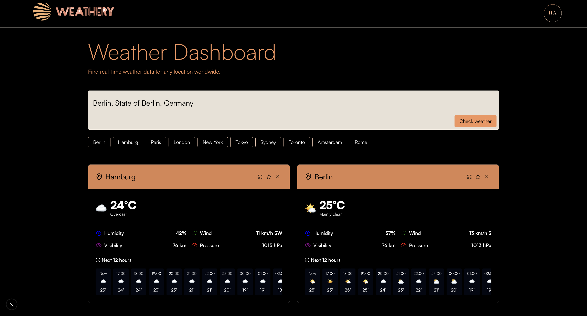

# 🌤️ Weathery

This is my submission for the Tecomon assignment. A modern, full-stack weather dashboard that lets users track real-time weather for multiple locations worldwide. Built with a **Next.js/React frontend** and **Node.js/Express backend**, this app features smart caching, soft deletes, favorites, location suggestions, and a clean, animated UI.



---

## 🚀 Features

- **Add locations** via search or popular cities
- **Favourite locations** via search or popular cities
- **Real-time weather data** from Open-Meteo API
- **Smart caching** to reduce API calls and improve performance
- **Soft delete** for widgets (data preserved)
- **Favorites system** with `localStorage` persistence
- **Location suggestions** using geocoding
- **Duplicate detection** with a sleek popup
- **Responsive design** with expandable widget views
- **404 pages** for invalid routes (frontend and backend)
- **Loading states, error handling, and smooth animations**
- **Clean separation of concerns** (controllers, services, models, utils)

---

## 🛠️ Tech Stack

### Frontend

- **Next.js**
- **React**
- **JavaScript** (ES6+)
- **Lucide Icons** for scalable vector icons
- **CSS** with custom animations and glass-morphism design
- **react-router-dom** (optional, for 404 page)

### Backend

- **Node.js** + **Express**
- **MongoDB** + **Mongoose** (for data persistence)
- **Axios** for external API calls
- **Caching Layer** using `Map` with TTL (Time-To-Live)
- **Geocoding & Weather APIs** via Open-Meteo

---

## 📦 Project Structure

```txt
weather-dashboard/
├── backend/
│ ├── controllers/ # Route handlers
│ ├── models/ # Mongoose models
│ ├── routes/ # Express routes
│ ├── services/ # Business logic (weather, caching)
│ ├── .env # Environment variables
│ └── server.js # Entry point
│
├── frontend/
│ ├── components/dashboardComponents/
│ │ ├── AddWidgetForm.jsx/ # To find location of widget
│ │ ├── Dashboard.jsx/ # General Dashboard page
│ │ └── WeatherWidget.jsx/ # Design and logic of widget
│ │ ├── LocationExistsPopup.jsx
│ ├── pages/dashboard/
│ │ ├── index.jsx
│ ├── utils/
│ │ ├── api.js # Centralized API calls
│ │ └── helper.js # Weather utilities
│ ├── components/
│ │ ├── LocationExistsPopup.jsx
│ │ └── Navbar.jsx
│ ├── pages/
│ │ ├── index.js
│ │ └── 404.js
├── .env
├── package.json
└── README.md
```

### 1. Backend setup

```bash
# Switch to the backend
cd backend

# Install dependencies
npm install

# Start development server
npm run dev
```

> 💡 Example `.env` file:

```env
PORT=5000
MONGODB_URI=mongodb://localhost:27017/widgets
NODE_ENV=development
WEATHER_API_URL=https://api.open-meteo.com/v1
CACHE_TTL_MINUTES=5
```

---

### 2. Frontend setup

```bash
# Switch to the frontend
cd frontend


# Install dependencies
npm install


# Start development server
npm run dev
```

> 💡 By default, the frontend runs under `http://localhost:3000`
> 💡 The backend should be accessible under `http://localhost:5000`

## 🧾 API Endpoints

| Method | Endpoint                   | Description                        |
| ------ | -------------------------- | ---------------------------------- |
| GET    | `/api/widgets/location`    | Get location suggestion            |
| GET    | `/api/widgets`             | List of all saved widgets          |
| POST   | `/api/widgets`             | Create new widget (`location`)     |
| DELETE | `/api/widgets/:id`         | Delete widget                      |
| POST   | `/api/widgets/:id/weather` | Weather data of widget(`location`) |

---

## ☁️ Weather API

I used Open Meteo as my weather API.

- [https://open-meteo.com/](https://open-meteo.com/) (No API key required)
